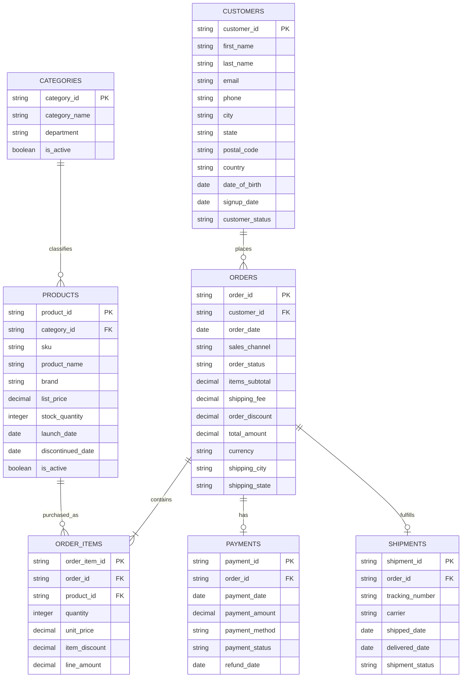

# E-commerce ER diagram

```mermaid
erDiagram
    CUSTOMERS ||--o{ ORDERS : places
    CATEGORIES ||--o{ PRODUCTS : classifies
    ORDERS ||--|{ ORDER_ITEMS : contains
    PRODUCTS ||--o{ ORDER_ITEMS : purchased_as
    ORDERS ||--o| PAYMENTS : has
    ORDERS ||--o| SHIPMENTS : fulfills
    CUSTOMERS {
        string customer_id PK
        string first_name
        string last_name
        string email
        string phone
        string city
        string state
        string postal_code
        string country
        date date_of_birth
        date signup_date
        string customer_status
    }
    CATEGORIES {
        string category_id PK
        string category_name
        string department
        boolean is_active
    }
    PRODUCTS {
        string product_id PK
        string category_id FK
        string sku
        string product_name
        string brand
        decimal list_price
        integer stock_quantity
        date launch_date
        date discontinued_date
        boolean is_active
    }
    ORDERS {
        string order_id PK
        string customer_id FK
        date order_date
        string sales_channel
        string order_status
        decimal items_subtotal
        decimal shipping_fee
        decimal order_discount
        decimal total_amount
        string currency
        string shipping_city
        string shipping_state
    }
    ORDER_ITEMS {
        string order_item_id PK
        string order_id FK
        string product_id FK
        integer quantity
        decimal unit_price
        decimal item_discount
        decimal line_amount
    }
    PAYMENTS {
        string payment_id PK
        string order_id FK
        date payment_date
        decimal payment_amount
        string payment_method
        string payment_status
        date refund_date
    }
    SHIPMENTS {
        string shipment_id PK
        string order_id FK
        string tracking_number
        string carrier
        date shipped_date
        date delivered_date
        string shipment_status
    }
```
